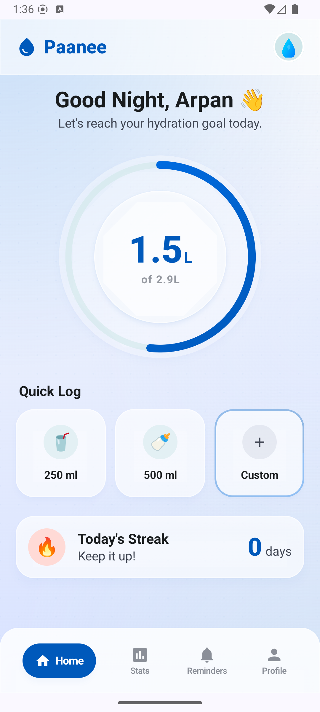
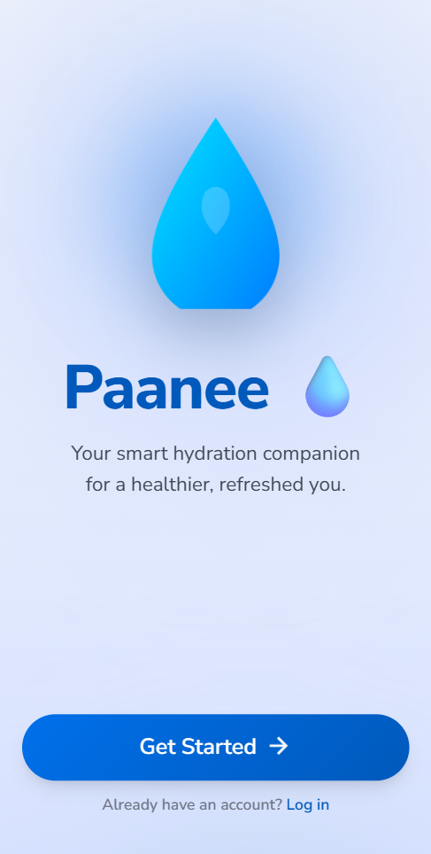
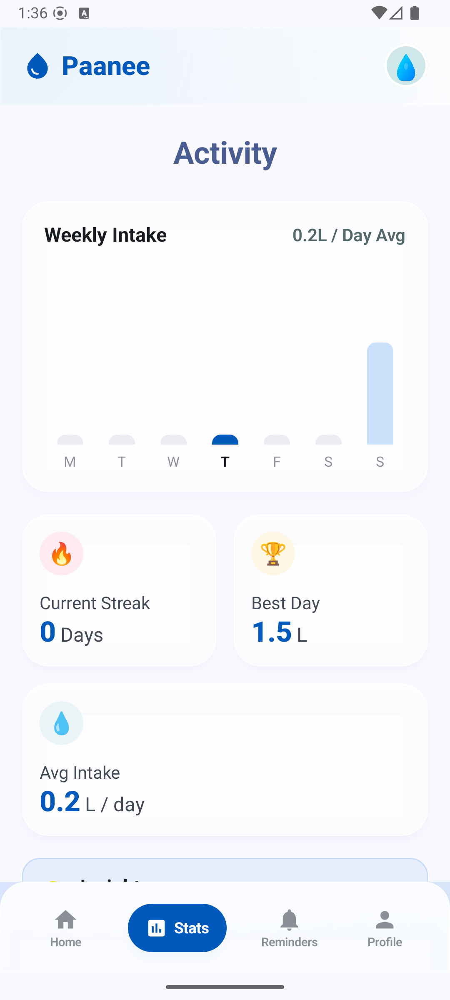
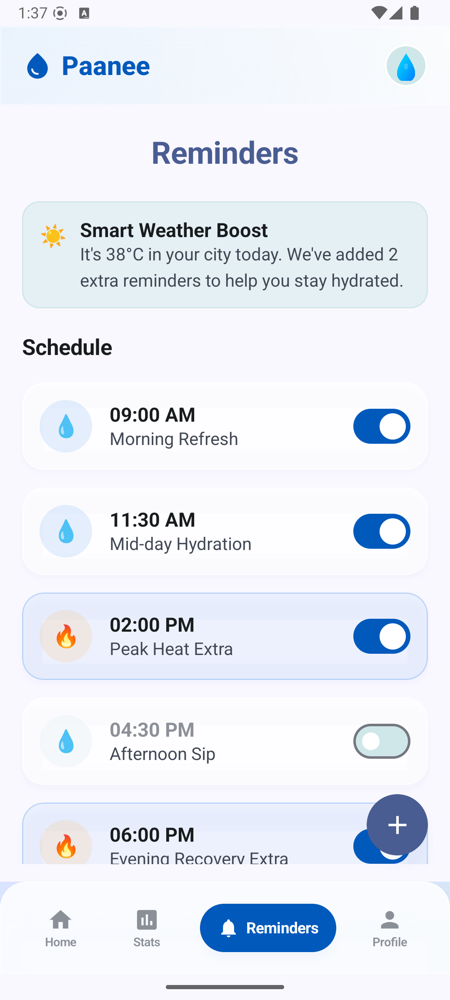
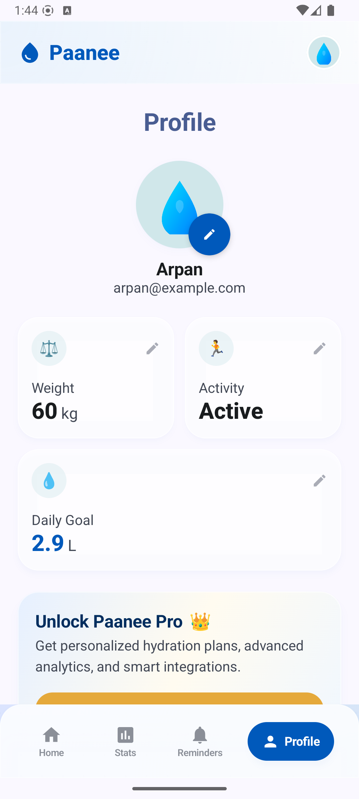

# Paanee 💧

Paanee is a premium, modern hydration tracking app built with Android, Jetpack Compose, and Kotlin. Designed with a sleek, minimalist aesthetic featuring glassmorphism accents, soft radial gradient blobs, and responsive gamified progress tracking.

---

## 📱 Visual Showcase

### Onboarding & Home Dashboard
<p align="center">
  
  &nbsp;&nbsp;&nbsp;&nbsp;
  
  &nbsp;&nbsp;&nbsp;&nbsp;
  
</p>

### Analytics, Reminders & Profile
<p align="center">
  
  &nbsp;&nbsp;&nbsp;&nbsp;
  
  &nbsp;&nbsp;&nbsp;&nbsp;
  
</p>

---

## ✨ Features

- **Dynamic Hydration Ring:** High-performance progress gauge with vector-drawn circular rings and smooth animations.
- **Glassmorphic Bento Grid:** Beautiful cards showing daily stats, streak counts, average consumption, and personal records.
- **Custom Logging Sheet:** Custom-built slide-up bottom sheet allowing select drink types (Water, Juice, Tea, Coffee) with precise ml controls (+/- buttons) and fast-add chips (+100ml, +250ml, +500ml).
- **Smart Reminders:** Intelligent weather-based hydration prompts that automatically add recovery alerts on high-temperature days.
- **Weekly Analytics:** Beautiful weekly bar chart showing daily consumption relative to the daily goal, updating dynamically with local DB logs.
- **Editable User Profile:** Dynamic calculation of daily water goals based on weight, sex, and activity level.

---

## 🛠️ Tech Stack

- **UI Framework:** Jetpack Compose (100% Kotlin Declarative UI)
- **Architecture:** Clean Architecture with MVVM
- **Local Database:** Room DB (For hydration history and logs)
- **Settings Store:** Preferences DataStore (Lightweight persistence for user profile details)
- **Dependency Injection:** Dagger Hilt (Android dependency management)
- **Background Jobs:** WorkManager (Schedules background hydration reminders)
- **Resource Styling:** Custom `Type.kt` utilizing Nunito Sans font variants, and custom vector drawing.

---

## 🚀 Getting Started

### Prerequisites
- Android Studio Koala / Ladybug or newer.
- Android SDK 34 (Upside Down Cake).
- Java 17 / JBR (Java Bundled Runtime).

### Installation
1. Clone this repository:
   ```bash
   git clone https://github.com/your-username/paanee.git
   cd paanee
   ```
2. Open the project in Android Studio.
3. Allow Gradle to sync and download all dependencies.
4. Run the app on an emulator (Android Virtual Device) or physical test device by clicking the **Run** button or executing:
   ```bash
   ./gradlew.bat installDebug
   ```
